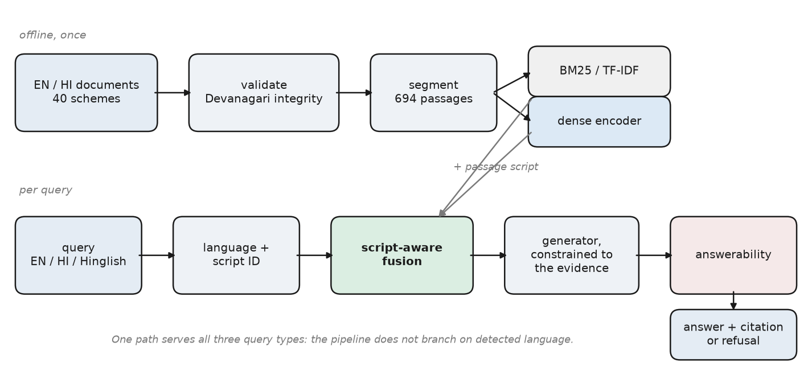
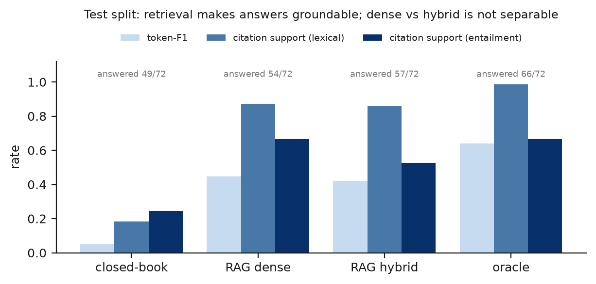
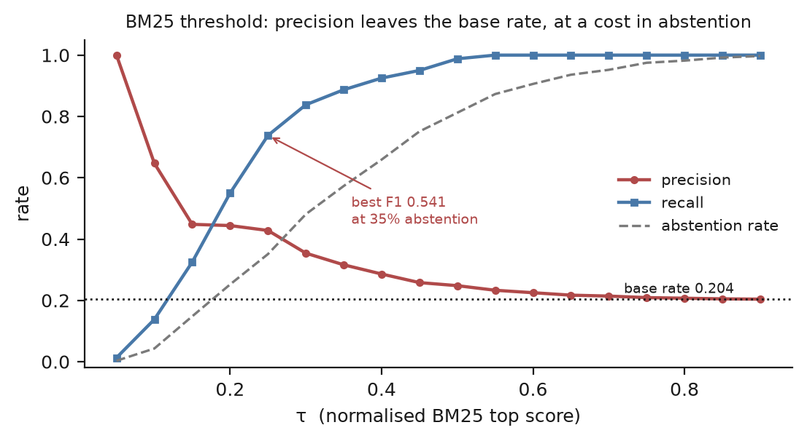

# IEEE conference version

Condensed from `paper.md` to the 6–8 page IEEE conference length. `paper.md` is
the full account and stays the source of record; every figure here appears there
with its derivation. Built by `python scripts/build-docx.py --ieee --pdf`.

---

## Abstract

Retrieval-augmented generation over multilingual corpora is commonly built by fusing a lexical retriever with a dense one, on the assumption that their errors are complementary. We show that this assumption fails in a specific and correctable way when a query and its evidence are written in different scripts. A lexical retriever cannot return a passage whose script differs from the query's, and under Reciprocal Rank Fusion (RRF) such a passage is penalised for that blindness rather than for its own irrelevance. On a bilingual Hindi–English corpus of Indian government welfare schemes and a sealed test split of 216 answerable questions, plain RRF reaches 0.274 Recall@5 on cross-lingual queries against 0.661 for its own dense component. **Script-aware fusion**, which scores each candidate over the retrievers eligible to return it, recovers 0.685 (+0.411, p = 0.0001) at no monolingual cost; its gain over dense retrieval alone is small (+0.030) and significant only on code-mixed queries. End to end, retrieval raises the share of answers supported by their cited evidence from 0.184 to 0.870, while the choice of retriever does not reach answer quality. For abstention, the BM25 top score separates answerable from unanswerable questions (AUC 0.791) where the fused score does not, and the generator's own abstention catches 22 of 23 near-miss questions. We release a 393-item QA set with a query-language × evidence-language matrix and a four-class unanswerable taxonomy, verified by a language model rather than by a person.

*Index Terms* — cross-lingual retrieval, hybrid retrieval, rank fusion, code-mixing, Hindi, retrieval-augmented generation, answerability.

## I. Introduction

Public-interest information in India is routinely published in one language and asked about in another. A citizen checking eligibility for a government scheme may be reading an English circular, or a separately authored Hindi counterpart, and asking in Hindi — or, very often, in Romanized Hindi–English code-mix: *"Scholarship ke liye minimum eligibility kya hai?"* Keyword search fails on this query three times over: the language, the script and the surface form all differ from the document's.

The accepted remedy for language mismatch is multilingual dense retrieval, and the accepted remedy for dense retrieval's weakness on rare terms — scheme names, amounts — is hybrid retrieval: fuse the dense ranking with a lexical one, most commonly by RRF [1]. We find that hybrid retrieval assembled this way does not merely fail to help cross-lingual queries; it harms them. On our test split plain RRF reaches 0.274 cross-lingual Recall@5 while its own dense retriever reaches 0.661.

The cause is structural. RRF treats agreement between retrievers as evidence and so discounts a candidate returned by one of them. Across a script boundary the lexical retriever has zero recall by construction, so its silence carries no information — yet fusion charges the candidate for it, exactly where the dense retriever is the only informative signal. The correction is to score each candidate over the retrievers *eligible* to return it. It needs no training and one lookup per candidate.

Our contributions are:

1. **Script-aware fusion**, with its structural cause, paired significance tests, and its limits: it removes a harm plain fusion introduces, and adds little over a strong dense retriever.
2. **A bilingual evidence-grounded QA set** of 393 items over six query-language × evidence-language cells and four unanswerable classes, with a sealed dev/test split. It was verified by a language model in two independent passes, not by a person, and every result states this.
3. **An end-to-end decomposition** with an oracle-evidence arm, separating retrieval error from generation error.
4. **A four-signal answerability comparison** showing which score carries an abstention signal and which classes each signal can see.

## II. Related Work

**Multilingual dense retrieval.** Sentence encoders trained with contrastive or translation-ranking objectives — LaBSE [2], multilingual E5 [3] and multilingual Sentence-BERT [4], [5] — place translation-equivalent texts near each other. Benchmarks such as Mr. TyDi [6], MIA 2022 [7] and AfriQA [8] establish that multilingual dense retrieval works and varies by language. They do not isolate what happens to a *fused* system when query and evidence scripts differ.

**Indic representations.** MuRIL [9] and IndicBERT [10] are pretrained on Indian-language text and evaluated on understanding benchmarks. Both are masked-language-model checkpoints without a trained sentence-pooling layer, and MLM representations are anisotropic [11], [12], a geometry that defeats similarity search. Their fitness for retrieval is usually assumed; we measure it.

**Hybrid retrieval.** RRF [1] is the default combiner because it needs no normalisation or tuning. Learned alternatives to the sparse half — ColBERT [13], SPLADE [14] — do not bridge a script boundary, since neither can match a Devanagari passage to a Latin query with no shared surface form. Tu and Padmanabhan [15] restrict sparse retrieval to the question's language in a dense–sparse hybrid, which avoids the retrieval problem; the fusion step still treats a dense-only passage as weakly evidenced.

**Answerability.** SQuAD 2.0 [16] made unanswerable questions a first-class target and wrote them to resemble answerable ones. Existing resources report an undifferentiated unanswerable class. We stratify it, because the classes behave differently under every signal we test.

## III. Dataset

### A. Corpus

The corpus is bilingual by construction: each of 40 government schemes is represented by an English and a Hindi Wikipedia article linked by Wikipedia's own interlanguage links, giving 80 independently authored documents in 14 scheme categories. We first attempted official ministry guidelines, but Hindi pages returned soft 404s and the guideline PDFs were image-only scans — an 18-page document yielded 17 characters of text — so the corpus is encyclopedic rather than regulatory, and we claim nothing about statutory prose. Every Hindi document passes five Devanagari integrity checks (misplaced vowel signs, dangling viramas, codepoint ratio, function-word rate, replacement characters). Structure-aware segmentation packs sections into 120–220-token passages with 25% overlap, giving 694 passages.

### B. Question set

The set was built as 400 items: 320 answerable, placed in an explicit matrix of query language against evidence language (Table I), and 80 unanswerable in four classes (Table II). Cross-lingual items translate the question and leave the evidence where it is, and gold evidence is a *set* of passages, so a fact stated in both language versions counts in either.

**TABLE I — Answerable items (verified), by query and evidence language**

| Query ↓ / Evidence → | English | Hindi | Total |
|---|---|---|---|
| English | 69 | 45 | 114 |
| Hindi (Devanagari) | 44 | 59 | 103 |
| Hinglish (Romanized) | 51 | 45 | 96 |
| **Total** | 164 | 149 | **313** |

This yields three groups: **monolingual** (128), **cross-lingual** (89), and **code-mixed** (96) — Romanized queries whose evidence is never in the query's script.

**TABLE II — Unanswerable taxonomy (verified)**

| Class | n | Definition |
|---|---|---|
| Out-of-scope | 25 | Topic absent from the corpus |
| Near-miss | 29 | Scheme present; the specific fact is not |
| False premise | 16 | Presupposes a benefit that does not exist |
| Under-specified | 10 | Unanswerable without naming a scheme |

Candidates were bootstrapped with Qwen2.5-3B-Instruct. **Verification was carried out by a language model (Claude Opus 5.5), not by a person.** A first pass read every item against its evidence and found 63 answerable items whose gold answer the passage contradicted or did not state, and 112 questions that were unreadable machine translation; these were corrected or replaced. A second pass by fresh instances confirmed 353 items, corrected 42 and rejected 5, and added other-language passages stating the same fact to 73 items. The result is 393 items (313 answerable, 80 unanswerable). A blind re-labelling of 59 items by another model instance agreed perfectly (κ = 1.000); that measures one model's consistency, not agreement between annotators. The set was split once, stratified by query language, answerability and scheme (seed 20260922): **dev 120, test 273** (216 answerable).

**Leakage.** Bootstrapped questions can copy their passage's wording and flatter lexical retrieval. On same-script items, question–passage content-token Jaccard has median 0.077, and within each same-script cell the BM25-minus-dense gap does not grow with overlap (all p ≥ 0.25).

## IV. System

Figure 1 shows the pipeline. Passages and queries receive identical normalization: NFC, Devanagari-to-ASCII digits, and danda-aware sentence splitting. Queries are classified as English, Indic or Code-Mixed by script ratio and a lexicon of Hindi function words split into unambiguous and ambiguous markers (*is*, *to* and *me* are also English words). The pipeline does not branch on the detected language.

**Retrieval.** Lexically, TF-IDF and BM25 (k₁ = 1.2, b = 0.75) run over a tokenizer that dispatches per token by script. Densely, we evaluate multilingual-e5-base (the primary encoder), MiniLM-L12, LaBSE and MuRIL under both mean and CLS pooling, with exact search. IndicBERT is a gated repository and could not be evaluated.

**Fusion.** Weighted fusion combines min-max normalised scores as α·lex + (1−α)·dense. RRF scores a passage d as Σᵢ 1/(k + rankᵢ(d)) with k = 60, summed over the retrievers that returned d.

**Script-aware fusion.** Let E(d) be the retrievers eligible to return d, where a lexical retriever is ineligible for a passage whose script differs from the query's. We score

s(d) = (2 / |E(d)|) · Σᵢ 1/(k + rankᵢ(d)),

so a cross-script passage is judged on its dense contribution alone, scaled to the range of same-script passages, instead of being docked for a vote that was never possible. Romanized queries are Latin-script, so Devanagari passages are ineligible for their lexical vote.

**Generation and answerability.** Qwen2.5-3B-Instruct (4-bit) answers from the top five passages with a cited passage identifier, or declines. Four answerability signals are compared: (1) a threshold on the top retrieval score; (4) a logistic combination of retrieval features (top score, margin, mean top-k, spread, scheme agreement); (2) the generator's own abstention; and (3) an NLI check that the cited passage entails the answer. All are fitted on dev by maximising F1 on the unanswerable class.

## V. Experimental Setup

Everything runs on a 4-core CPU with 16 GB RAM and no GPU, so every figure is reproducible on commodity hardware. Retrieval is scored with Recall@5, MRR and nDCG@10 against the gold passage set; QA with Exact Match, token-F1 and **Citation Support Rate** (CSR) — the share of answered questions whose answer the cited passage supports, lexically (in-order token overlap) or by entailment. Every headline figure carries a 95% percentile-bootstrap interval (1000 resamples); comparisons use a two-sided paired randomization test (10 000 trials) paired on question. Thresholds are fitted on dev; the retrieval configuration was fixed before the gold set existed; the test split is scored once.

## VI. Results

### A. Retrieval

**TABLE III — Recall@5 on the test split (216 answerable questions)**

| System | all [95% CI] | mono (83) | cross (62) | code-mix (71) |
|---|---|---|---|---|
| BM25 | 0.581 [0.519, 0.646] | 0.970 | 0.153 | 0.500 |
| TF-IDF | 0.593 | 0.964 | 0.185 | 0.514 |
| e5-base | 0.720 [0.660, 0.775] | 0.976 | 0.661 | 0.472 |
| LaBSE | 0.485 | 0.655 | 0.540 | 0.239 |
| MiniLM-L12 | 0.478 | 0.624 | 0.605 | 0.195 |
| MuRIL (mean) | 0.265 | 0.582 | 0.048 | 0.082 |
| Weighted, α = 0.4 | 0.688 | 0.976 | 0.484 | 0.528 |
| Plain RRF | 0.618 [0.556, 0.681] | 0.964 | 0.274 | 0.514 |
| **Script-aware RRF** | **0.750** [0.692, 0.806] | 0.964 | **0.685** | **0.556** |

**Lexical retrieval does not cross scripts** (Fig. 2): BM25 scores 0.970 monolingual and 0.153 cross-lingual. e5-base is the best single retriever, +0.139 over BM25 overall (p = 0.0001). **MuRIL**, pretrained on Indic text but not for retrieval, reaches 0.048 cross-lingual under its better pooling: pretraining-language coverage does not substitute for retrieval training.

**Plain fusion destroys the dense retriever's cross-lingual recall, and script-aware fusion restores it** (Fig. 3). Against plain RRF, script-aware fusion gains +0.411 cross-lingual (p = 0.0001, n = 62) and +0.132 overall (p = 0.0001), at no monolingual cost (0.964 against 0.964).

**Against dense retrieval alone the gain is small.** Script-aware fusion is +0.030 over e5-base overall (p = 0.052) and +0.024 cross-lingual (p = 0.62); the only significant gain is on code-mixed queries, +0.085 (p = 0.004), where Romanized questions carry English scheme names the lexical retriever can match. Weighted fusion never beats pure dense at any α (best α = 0.1 ties α = 0 at 0.720), so H2 in its weighted form is not supported. The correction improves every encoder it is applied over (dev and test pooled: e5 +0.028, MiniLM +0.162, LaBSE +0.085), more for weaker ones, as a change of arithmetic rather than of representation predicts.

We read this as a narrower claim than the unverified questions suggested, where script-aware fusion beat dense alone by +0.133 cross-lingually: standard fusion does harm across scripts, the correction removes it, and over a strong multilingual dense retriever fusing adds little outside code-mixed queries.

### B. Direct LLM against RAG

Four arms share one generator and differ only in evidence: **A** closed-book, **B** dense RAG, **C** script-aware RAG, **D** an oracle given the gold passage. We run them on a 72-item stratified sample of the test split.

**TABLE IV — Question answering, 72 test questions per arm**

| Arm | token-F1 [95% CI] | abstains | CSR (lex) | CSR (NLI) |
|---|---|---|---|---|
| A closed-book | 0.050 [0.032, 0.070] | 0.319 | 0.184 | 0.245 |
| B RAG-dense | **0.446** [0.351, 0.545] | 0.250 | **0.870** | 0.667 |
| C RAG-hybrid | 0.418 [0.323, 0.517] | 0.208 | 0.860 | 0.526 |
| D oracle | 0.641 [0.548, 0.731] | 0.083 | 0.985 | 0.667 |

**Retrieval makes answers groundable** (Fig. 4). CSR rises from 0.184 closed-book to 0.870 with dense retrieval, +0.684 paired over the 38 questions both answered (p = 0.0001). The closed-book arm answers 49 of 72 questions, and fewer than one in five of those answers is supported; when it names a source at all, the source does not exist.

**The choice of retriever does not reach the answers.** Arm C against B is −0.027 token-F1 (p = 0.55) and +0.000 CSR (p = 1.00). The sample holds 24 code-mixed questions, too few to carry a retrieval gain of +0.085 through a generator.

**Both components lose comparable amounts.** The oracle decomposes the remaining error into retrieval error (D − C) of 0.223 and generation error (1 − D) of 0.359, and the retrieval headroom is significant (p = 0.0002). On the unverified items it was 0.597 against 0.193; we cannot separate how much of that change is verification and how much the sample, but the practical reading moved from "fix the generator" to "both matter".

### C. Answerability

**TABLE V — Threshold and calibrated signals on the test split (273 items, 57 unanswerable)**

| Signal | score | F1 (UNANS) | precision | recall | abstains |
|---|---|---|---|---|---|
| threshold | BM25 top | **0.525** | 0.408 | 0.737 | 38% |
| calibrated | BM25 features | 0.481 | 0.431 | 0.544 | 26% |
| threshold | fused RRF top | 0.381 | 0.240 | 0.930 | 81% |
| calibrated | RRF features | 0.454 | 0.435 | 0.474 | 23% |

**The lexical score separates the classes; the fused score does not.** Under BM25 the median top score is 25.5 for answerable questions and 13.8 for unanswerable ones (AUC 0.791, Fig. 5). Under script-aware RRF it is 0.0328 against 0.0325: rank fusion discards magnitudes. A BM25 threshold fitted on dev catches every out-of-scope test question but only 0.522 of near-misses, whose passages are genuinely about the right scheme.

**Only the generator can see a missing fact.** On a 120-item sample enriched to hold every unanswerable item, reporting on its 85 test-split items (57 unanswerable), the four signals compare as follows:

**TABLE VI — Four signals, 85 held-out items (enriched sample)**

| Signal | F1 | unanswerable caught | answerable answered | near-miss |
|---|---|---|---|---|
| 1. threshold (fused) | 0.779 | 53 / 57 | 2 / 28 | 0.913 |
| 4. calibrated | 0.746 | 44 / 57 | 11 / 28 | 0.739 |
| 2. generator self-report | **0.889** | 52 / 57 | **20 / 28** | **0.957** |
| 3. NLI entailment | 0.889 | 52 / 57 | 20 / 28 | 0.957 |

The threshold's recall is refusal: it answers 2 of 28 answerable questions. The generator answers 20 while catching 52 of 57 unanswerable and 22 of 23 near-misses. NLI is identical because its fitted threshold is zero — of the 25 questions the generator answers only 5 are unanswerable, leaving nothing for a second filter to catch. A deployment would combine them in sequence: the BM25 floor removes out-of-scope questions before generation, and the generator's abstention handles near-misses.

## VII. Error Analysis

We select failures by rule — within each of ten taxonomy categories, the most confident miss — on the test split over script-aware fusion, giving 15 cases across 8 categories. In 12 the right scheme is in the top five but the passage stating the fact is not, often because that passage is in the other language. Reading the cases corrects the automatic diagnosis twice. In one, the first result states the answer, but 25% segment overlap copied the sentence into a passage the gold set does not list, so a correct retrieval is scored as a miss. In another, a fact appears only in an article filed under a different scheme.

One case exposed a defect in script-aware fusion itself: BM25 returned a Hindi passage for a Romanized query through the one Latin word it quotes, and the eligibility rule doubled a vote that had been cast, lifting an irrelevant passage to rank 1. Because the defect was found on test, we decided on dev whether to correct it. Counting a cast vote as eligible is *worse* there (−0.026 overall, −0.093 cross-lingual, both n.s.), and it changes six queries across both splits, losing five: in four of them BM25 reached a cross-script gold passage through a year or number in the question. A cast cross-script vote is usually real evidence, and the rule stays.

The method itself came from an earlier selection of twenty failures over plain RRF, in which dense retrieval alone had found the gold passage in eight and plain RRF lost all eight. The aggregate table showed only that hybrid retrieval underperformed; the cases showed why.

## VIII. Discussion

The mechanism is not about Hindi. It arises wherever rank fusion runs over retrievers with *asymmetric coverage* — text and image retrievers, access-controlled shards, a specialist index over a partly covered collection. Before fusing, check whether each retriever *could* have retrieved what the other did, not only how accurate each is. Where coverage is asymmetric, fuse over the eligible retrievers.

The end-to-end numbers bound the claim. Retrieval is what makes answers groundable, but which retriever supplies the passages did not change answer quality at our sample size, and the generator still loses more than retrieval does. Script-aware fusion is a retrieval result, measured as retrieval.

## IX. Limitations

**No person verified the evaluation set.** Both verification passes and the blind second pass were run by a language model; κ = 1.000 between model instances measures consistency, not the inter-annotator agreement the protocol required, and a gold set checked only by a model inherits its judgement. A human pass over at least the test split is the most valuable outstanding work. **Scope:** one Indic language and two scripts; an encyclopedic rather than regulatory corpus; 313 answerable items, so per-cell differences of a few points are not resolvable; Module 4 on a 72-item sample; a 3B 4-bit generator; no fine-tuning. **Probes:** our first analyses used 180 synthetic probes, which found the mechanism but overstated the gain over dense retrieval; the figures reported here are all from the verified test split.

## X. Conclusion

Reciprocal Rank Fusion applied unmodified to a lexical and a dense retriever over a bilingual collection penalises cross-script passages for the lexical retriever's inability to return them, discarding the only informative evidence in exactly the cross-lingual and code-mixed cases such a system exists to serve. Scoring each candidate over the retrievers eligible to return it corrects this — cross-lingual Recall@5 from 0.274 to 0.685 on our test split, with no monolingual cost and no training — though over a strong dense retriever alone the corrected hybrid gains little. The result was invisible in the aggregate metrics and was recovered from a structured reading of failure cases. Future work is a human verification pass, a non-Devanagari Indic script, and the eligibility formulation outside language.

## References

[1] G. V. Cormack, C. L. A. Clarke, and S. Büttcher, "Reciprocal rank fusion outperforms Condorcet and individual rank learning methods," in *Proc. SIGIR*, 2009, pp. 758–759.

[2] F. Feng, Y. Yang, D. Cer, N. Arivazhagan, and W. Wang, "Language-agnostic BERT sentence embedding," in *Proc. ACL*, 2022, pp. 878–891.

[3] L. Wang *et al.*, "Multilingual E5 text embeddings: A technical report," arXiv:2402.05672, 2024.

[4] N. Reimers and I. Gurevych, "Sentence-BERT: Sentence embeddings using Siamese BERT-networks," in *Proc. EMNLP-IJCNLP*, 2019.

[5] N. Reimers and I. Gurevych, "Making monolingual sentence embeddings multilingual using knowledge distillation," in *Proc. EMNLP*, 2020.

[6] X. Zhang *et al.*, "Mr. TyDi: A multi-lingual benchmark for dense retrieval," arXiv:2108.08787, 2021.

[7] A. Asai *et al.*, "MIA 2022 shared task: Evaluating cross-lingual open-retrieval question answering for 16 diverse languages," arXiv:2207.00758, 2022.

[8] O. Ogundepo *et al.*, "AfriQA: Cross-lingual open-retrieval question answering for African languages," arXiv:2305.06897, 2023.

[9] S. Khanuja *et al.*, "MuRIL: Multilingual representations for Indian languages," arXiv:2103.10730, 2021.

[10] D. Kakwani *et al.*, "IndicNLPSuite: Monolingual corpora, evaluation benchmarks and pre-trained multilingual language models for Indian languages," in *Findings of EMNLP*, 2020.

[11] B. Li, H. Zhou, J. He, M. Wang, Y. Yang, and L. Li, "On the sentence embeddings from pre-trained language models," in *Proc. EMNLP*, 2020.

[12] "Exploring anisotropy and outliers in multilingual language models for cross-lingual semantic sentence similarity," arXiv:2306.00458, 2023.

[13] O. Khattab and M. Zaharia, "ColBERT: Efficient and effective passage search via contextualized late interaction over BERT," in *Proc. SIGIR*, 2020, pp. 39–48.

[14] T. Formal, B. Piwowarski, and S. Clinchant, "SPLADE: Sparse lexical and expansion model for first stage ranking," in *Proc. SIGIR*, 2021.

[15] Tu and Padmanabhan, "MIA 2022 shared task submission: Leveraging entity representations, dense-sparse hybrids, and fusion-in-decoder for cross-lingual question answering," arXiv:2207.01940, 2022.

[16] P. Rajpurkar, R. Jia, and P. Liang, "Know what you don't know: Unanswerable questions for SQuAD," in *Proc. ACL*, 2018, pp. 784–789.
