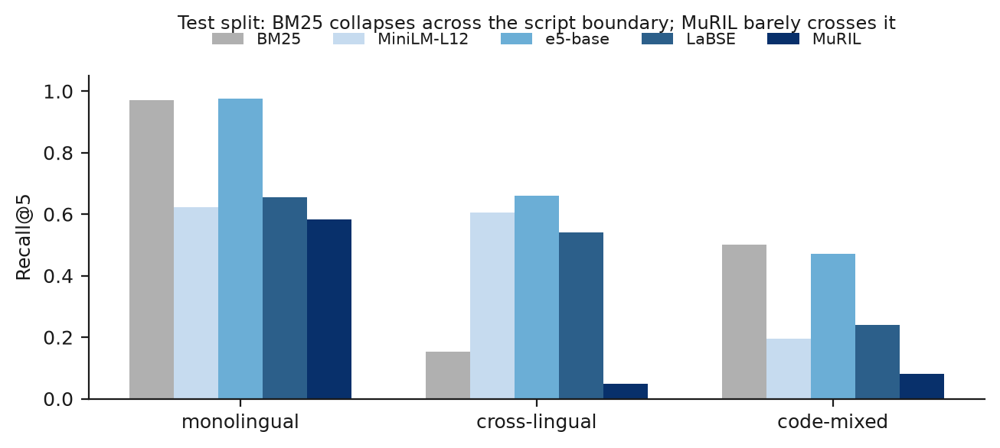
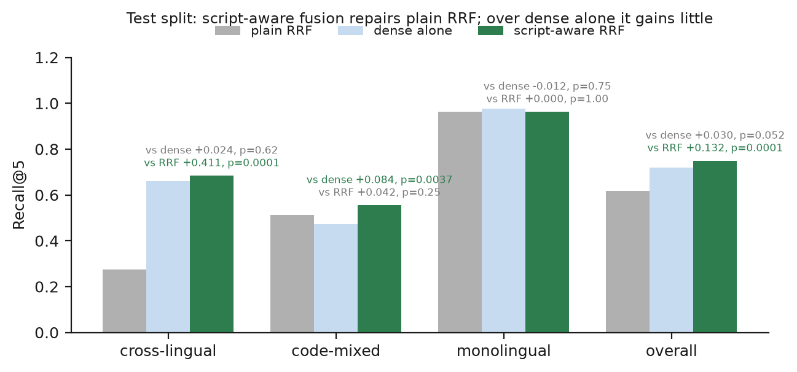
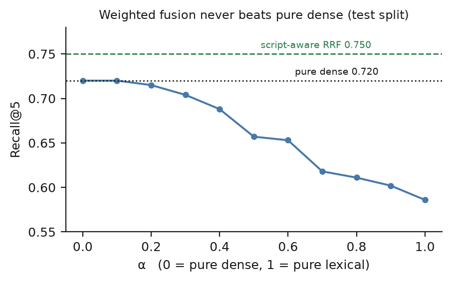

# Section VI — Results

All five modules are written from measured numbers.

**What the numbers rest on.** The headline results (§VI-A) are measured on the
gold set after verification — 393 items, 313 answerable — and, for every claim
the paper makes, on its sealed **test split of 273 items (216 answerable)**,
scored once. That verification was carried out by a language model rather than
a person (§III-D), and every figure here should be read as model-verified. The
earlier analyses in §VI-B to §VI-F were measured on 180 synthetic probes before
the gold set existed; they are kept, marked `[PROBE]`, because they are where
the mechanism was found, and §VI-A says where the verified set confirms them and
where it does not. The question-answering figures (§VI-G) are on a 72-item
sample of the test split, and answerability (§VI-H) fits its threshold on the
dev split and reports on test.

---

## VI. Results

### A. Headline results on the verified gold set

The corpus is 694 passages over 40 schemes in English and Hindi, with all 80
documents passing Devanagari integrity validation.

**TABLE II — Recall@5 on the test split (216 answerable questions), with 95% bootstrap intervals**

| System | all | monolingual (83) | cross-lingual (62) | code-mixed (71) |
|---|---|---|---|---|
| BM25 | 0.581 [0.519, 0.646] | 0.970 | 0.153 | 0.500 |
| TF-IDF | 0.593 | 0.964 | 0.185 | 0.514 |
| multilingual-e5-base | 0.720 [0.660, 0.775] | 0.976 | 0.661 | 0.472 |
| LaBSE | 0.485 | 0.655 | 0.540 | 0.239 |
| MiniLM-L12 | 0.478 | 0.624 | 0.605 | 0.195 |
| MuRIL (mean pooling) | 0.265 | 0.582 | 0.048 | 0.082 |
| Hybrid, weighted α = 0.4 | 0.688 | 0.976 | 0.484 | 0.528 |
| Hybrid, plain RRF | 0.618 [0.556, 0.681] | 0.964 | 0.274 | 0.514 |
| **Hybrid, script-aware RRF** | **0.750** [0.692, 0.806] | 0.964 | **0.685** | **0.556** |

Three findings carry the paper, and the verified set confirms the first two
more cleanly than any earlier measurement and qualifies the third.

**Lexical retrieval does not cross the language boundary.** BM25 reaches 0.970
on monolingual questions and 0.153 on cross-lingual ones. MuRIL, pretrained on
Indic text but not trained for retrieval, reaches 0.048. Figure 2 plots the
breakdown.

**Plain fusion destroys the dense retriever's cross-lingual recall, and the
script-aware correction restores it.** Plain RRF over BM25 and e5-base reaches
0.274 on cross-lingual questions, against 0.661 for the dense retriever it
contains: adding a lexical retriever that cannot see across the script boundary
costs the hybrid system more than half of what its dense half finds. Script-aware
fusion, which stops docking a passage for the lexical retriever's blindness to
its script (§IV-E), recovers 0.685. Paired against plain RRF it gains +0.411 on
the cross-lingual slice and +0.132 overall (both p = 0.0001, n = 62 and 216),
and costs nothing monolingually (0.964 against 0.964). This is the result the
method was designed around, and it is larger on the verified test split than on
the probes (+0.131) or on the unverified set (+0.389 on the pooled items).

**Against dense retrieval alone, the gain is small, and significant only on
code-mixed questions.** This is where the verified set changes the story. Before
verification, script-aware fusion beat e5-base alone by +0.133 on cross-lingual
questions and +0.081 overall. On the test split it is +0.024 cross-lingually
(p = 0.62) and +0.030 overall (p = 0.052); the only significant gain is on
code-mixed questions, +0.085 (p = 0.0037), where Romanized questions carrying
English scheme names give the lexical retriever something real to contribute.
Pooling dev and test for power, the overall gain is +0.027 (p = 0.021). The
margin shrank when verification rewrote 112 garbled questions, most of them in
the cross-lingual and code-mixed cells; our reading is that fusion was partly
compensating for questions a dense retriever could not match because they did
not say what they asked, though the rewrite and the relabelling changed too much
at once to isolate that cause. On well-formed questions, a
strong multilingual dense retriever alone does nearly as well as the corrected
hybrid. Figure 3 shows both comparisons on every slice.

So the claim this paper can make is specific. Hybrid retrieval assembled the
standard way is actively harmful across scripts, the harm is structural, and a
change of arithmetic removes it at no cost. Whether hybrid retrieval is worth
assembling at all, over a good dense retriever alone, is a closer call than we
reported before verification: it helps on code-mixed queries and is otherwise
within noise.

**Weighted fusion does not help at any weighting.** Sweeping α over e5-base and
BM25, no interior weighting beats pure dense on the test split (best α = 0.1 at
0.720, equal to α = 0; Figure 4), and none does on the pooled set (0.728 at
α = 0.1 against 0.736). H2, in its weighted-fusion form, is not supported. An
earlier version of this section reported the opposite; that sweep used the wrong
dense encoder for its endpoint, and was corrected before verification.

### A.1 The correction is orthogonal to encoder choice

§VIII-E argues that the mechanism is about asymmetric coverage rather than about
any particular encoder. Applying the same correction over each dense retriever
(pooled dev and test, 313 questions):

| Encoder | dense alone | with script-aware fusion | gain |
|---|---|---|---|
| multilingual-e5-base | 0.736 | **0.764** | +0.028 |
| MiniLM-L12 | 0.504 | 0.666 | +0.162 |
| LaBSE | 0.512 | 0.597 | +0.085 |

Fusion improves every one, and the weaker the dense retriever the more the
lexical half contributes once it is no longer allowed to penalise what it
cannot see. Fusing over e5-base remains the best configuration: fusing over
MiniLM is worse by 0.097 and over LaBSE by 0.167 overall (both p ≤ 0.0003).
MiniLM's fusion leads the cross-lingual slice (0.736 against 0.669) but not
significantly (p = 0.26), and loses heavily on every other slice.

### A.2 What the probe-set sections below do and do not show

§VI-B to §VI-F were measured on 180 synthetic probes, 120 of them monolingual
and many lifting phrasing directly from their target passage, which flatters
lexical retrieval. They are kept because they are where the fusion penalty was
first found and diagnosed (§VIII), and the mechanism they describe — zero
lexical recall across a script boundary, and a fusion rule that docks passages
for it — is structural and is confirmed above. Their magnitudes are not the
paper's results. Where they disagree with Table II, Table II stands; in
particular §VI-F's observation that LaBSE leads the code-mixed slice does not
hold on real questions (LaBSE 0.239 against 0.500 for BM25 and 0.556 for
script-aware fusion).

### B. Lexical against dense retrieval (Module 1)

**Recall@5, overall, with 95% bootstrap confidence intervals** `[PROBE]`

| System | R@1 | R@5 | MRR | nDCG@10 | R@5 95% CI |
|---|---|---|---|---|---|
| BM25 | 0.358 | 0.499 | 0.481 | 0.476 | [0.429, 0.565] |
| TF-IDF | 0.347 | 0.501 | 0.477 | 0.471 | [0.430, 0.569] |
| MiniLM-L12 (multilingual) | 0.122 | 0.303 | 0.280 | 0.282 | [0.239, 0.366] |
| multilingual-e5-base | 0.210 | 0.449 | 0.406 | 0.420 | [0.386, 0.516] |
| LaBSE | 0.175 | 0.361 | 0.361 | 0.341 | [0.298, 0.433] |
| MuRIL (mean-pooled) | 0.144 | 0.238 | 0.206 | 0.220 | [0.178, 0.299] |
| MuRIL (CLS-pooled) | 0.059 | 0.143 | 0.127 | 0.134 | [0.099, 0.193] |

BM25 leads overall, and the best dense encoder trails it by 0.049
(p = 0.10, not significant). We do **not** read this as evidence that lexical
retrieval beats dense retrieval on this task. It is a property of the probe mix
described in §VI-A — two thirds monolingual, many quoting the target passage —
and the honest statement is that this comparison is not established either way
on this data. The aggregate row is reported for completeness and the
language-pair breakdown that follows is what carries the finding.

`ai4bharat/indic-bert`, named in the project brief, could not be evaluated: the
repository is gated and returns HTTP 401 without an accepted licence.

### C. The language-pair breakdown (Module 2)

The aggregate table conceals the result. Split by language group, the same
systems behave in categorically different ways.

**Recall@5 by language group** `[PROBE]`

| System | Monolingual (n=120) | Cross-lingual (n=30) | Code-mixed (n=30) |
|---|---|---|---|
| BM25 | **0.740** | 0.006 | 0.028 |
| TF-IDF | 0.745 | 0.006 | 0.019 |
| MiniLM-L12 | 0.394 | 0.136 | 0.102 |
| multilingual-e5-base | 0.610 | 0.125 | 0.132 |
| LaBSE | 0.435 | 0.097 | **0.332** |
| MuRIL (mean-pooled) | 0.357 | **0.000** | **0.000** |

Lexical retrieval does not cross the language boundary at all: BM25 scores 0.740
monolingual and 0.006 cross-lingual — a factor of more than a hundred. The verified
test split (Table II, Figure 2) has the same shape at less extreme magnitudes,
0.970 against 0.153, because real questions carry scheme names and numbers that
occasionally survive the script change. This is
not a weakness to be tuned away but the expected consequence of matching surface
tokens between a Devanagari query and a Latin-script passage that share
essentially none. It is the empirical form of the structural claim in §VIII, and
it is what makes the fusion behaviour in §VI-E a predictable consequence rather
than a surprise.

### D. Indic pretrained checkpoints underperform, with pooling controlled

MuRIL, pretrained on seventeen Indian languages, is the weakest dense encoder
tested at 0.238 Recall@5. It sits below MiniLM-L12 at 0.303, a model with
roughly half the parameters but trained with a retrieval objective — though we
note that this particular ordering is **not statistically established**: paired
over the 180 probes the gap is +0.065 at p = 0.069, which does not clear the
0.05 level we report against elsewhere. We ran both mean and CLS pooling and
report the better, so the result is not a pooling artefact; CLS pooling is worse
still at 0.143.

The sharpest form of the result needs no test at all, and is in the breakdown:
MuRIL scores **exactly 0.000** on both the cross-lingual and the code-mixed
slices — not a small number, but no correct retrieval in 60 queries. The model
pretrained on seventeen Indian languages is the one that cannot retrieve between
two of them.

The explanation is the known anisotropy of masked-language-model representations.
An MLM checkpoint is trained to predict masked tokens, not to place
paraphrases near one another, and its mean-pooled output occupies a narrow cone
in which cosine similarity discriminates poorly. Pretraining-language coverage
does not substitute for retrieval training. We report this because the brief
names these checkpoints and because the assumption that an Indic-pretrained
model is the right choice for an Indic retrieval task is a natural one to make.

### E. Script-aware fusion (Module 3)

Plain Reciprocal Rank Fusion over BM25 and multilingual-e5-base scores 0.022 on
cross-lingual queries — **below the 0.125 of the dense retriever it contains**.
Fusion is actively destroying information on precisely the slice it was added to
help. §VIII gives the mechanism; the correction is to score each candidate over
the retrievers *eligible* to return it rather than those that did.

**Recall@5, script-aware against plain RRF, paired randomization test (10 000
trials)** `[PROBE]`

| Slice | Plain RRF | Script-aware | Δ | p |
|---|---|---|---|---|
| cross-lingual | 0.022 | **0.153** | +0.131 | 0.0001 * |
| code-mixed | 0.028 | **0.173** | +0.145 | 0.0002 * |
| monolingual | 0.712 | 0.668 | −0.044 | 0.032 * |
| overall | 0.483 | 0.500 | +0.017 | 0.32 |

Figure 5 plots the table, with the monolingual regression on the same axes as
the gains rather than in a separate panel.

![Fig. 5. [PROBE] Script-aware against plain RRF on the 180 synthetic probes, where the mechanism was found. The monolingual cost shown here does not appear on the verified set (Figure 3).](figures/fig5-fusion-probes.png)
 Against dense alone — the comparison
that decides whether hybrid retrieval earns its place at all — script-aware
fusion gains +0.028 cross-lingual (p = 0.037),
+0.041 code-mixed (p = 0.074) and +0.050 overall (p = 0.0086).

Three things should be read from this table rather than one.

First, the gain on the target slices is large and significant. Second, the
monolingual regression is real, significant, and the price of the method:
removing the lexical double-vote costs precision where both retrievers could see
the same passage and agreement between them genuinely was evidence. Third, the
overall row is indistinguishable from noise, and a paper reporting only that row
would conceal both the gain and the cost.

This also revises the negative result of the α sweep, which on the probes found
no interior weighting significantly better than the better endpoint (the best,
α = 0.4, was +0.025 over pure lexical at p = 0.13) and recorded the hybrid
hypothesis as unsupported. That verdict was correct about weighted fusion, and on
the verified set no weighting beats pure dense at all (Figure 4). Whether hybrid
retrieval beats its components once fusion stops penalising passages for their
script is answered in §VI-A: it does on code-mixed queries, and is within noise
elsewhere.

### F. A caveat the fusion result does not remove

LaBSE, used alone, reaches **0.332** on the code-mixed slice against 0.173 for
script-aware fusion over BM25 and e5-base. Paired over the 30 code-mixed
queries that is +0.159 at **p = 0.0094**, so on code-mixed queries choosing a
different encoder genuinely outperforms correcting the fusion over a weaker one.

The reverse holds elsewhere, and equally significantly. On the monolingual slice
LaBSE loses to the fused system by 0.233 (p = 0.0001), and on the cross-lingual
slice it is behind by 0.056, which is within noise (p = 0.34). LaBSE is not a
better retriever; it is a differently shaped one, and the shape happens to suit
Romanized Hindi.

We state this plainly because it qualifies the practical reading of §VI-E. The
fusion correction is orthogonal to the choice of encoder: it is a statement
about how rankings are combined, and nothing prevents applying it over LaBSE.
§VI-A.1 does so on the verified set: fusion over LaBSE gains +0.085 over LaBSE
alone, and remains well below fusion over e5-base.

The result contradicts our own prior expectation, recorded before the
experiment, that LaBSE would lead the cross-lingual slice by virtue of its
translation-ranking objective. Instead it is the only model that handles
Romanized Hindi well. On the probes that suggested selecting the encoder by query
*script* rather than by language coverage. It did not survive the gold set
(§VI-A.2): on verified code-mixed questions LaBSE reaches 0.239, against 0.500
for BM25 and 0.556 for script-aware fusion. We have not tested why the probes
favoured it; the verification pass respelled the code-mixed questions, which
changed their wording as well as their quality, so the two cannot be separated.

### G. Direct LLM against RAG (Module 4)

We run four arms over a 72-item sample stratified across the six
language-pair cells: **A** closed-book, the model answering from its own
parameters with no passages; **B** retrieval-augmented with dense retrieval;
**C** retrieval-augmented with script-aware fusion; and **D** an oracle given
the gold passage directly. The generator is Qwen2.5-3B-Instruct at 4-bit
quantization throughout, so the arms differ only in the evidence they receive.

**Module 4, 72 items per arm** `[PROBE]`

| Arm | EM | token-F1 | abstains | Citation Support |
|---|---|---|---|---|
| A closed-book | 0.014 | 0.065 | 0.486 | 0.162 |
| B RAG-dense | 0.139 | 0.207 | 0.417 | 0.762 |
| C RAG-hybrid | 0.139 | **0.210** | 0.361 | **0.826** |
| D oracle | 0.264 | 0.403 | 0.194 | 0.948 |

**H3 is supported, and by a wide margin.** Citation Support Rate — the share of
answered questions whose answer the cited evidence actually supports — rises
from 0.162 closed-book to 0.826 with retrieval, and to 0.948 given the gold
passage. The closed-book arm answers 37 of 72 questions and only 16% of those
answers are supported by the evidence that would have justified them. It is not
declining to answer; it is answering from memory about specific eligibility
thresholds and scheme parameters, and is usually wrong. This is the behaviour
the system exists to prevent, and retrieval prevents most of it.

Abstention falls monotonically as the evidence improves, from 0.486 to 0.417 to
0.361 to 0.194. The generator abstains less when it has something to work from,
which is the desired direction: the abstentions are responding to the absence of
evidence rather than to a fixed conservatism.

**The fusion result does not measurably propagate to generation, and the
unpaired table is misleading about it.** Arm C's citation support of 0.826
against arm B's 0.762 is computed over different denominators — the arms answer
46 and 42 questions respectively — and paired over the 39 questions both
answered, the difference is +0.026 at p = 1.00. On token-F1 it is +0.003 at
p = 0.89.

| Comparison | token-F1 | citation support |
|---|---|---|
| B vs A | +0.141, p = 0.0003 * | +0.593, p = 0.0001 * |
| C vs B | +0.003, p = 0.89 | +0.026, p = 1.00 |
| D vs C | +0.193, p = 0.0002 * | +0.143, p = 0.068 |

So the honest statement is narrower than the retrieval numbers invite. Retrieval
versus no retrieval is a large, significant effect on both metrics. *Which*
retriever, at this sample size and with this generator, is not distinguishable:
the 0.131 Recall@5 gain of §VI-E does not produce a detectable difference in
answer quality or grounding over dense retrieval alone.

We do not read this as evidence that the fusion gain is illusory — §VI-E
measures it directly and significantly, and the oracle row shows retrieval
headroom of 0.193 that is significant at p = 0.0002. We read it as the expected
consequence of a generator that loses 0.597 on its own (§VI-G.1): a retrieval
improvement has to survive that noise floor to show up downstream, and on 72
questions it does not. A larger sample, or a generator that wastes less of the
evidence it is given, would be the way to detect it if it is there.

### G.1 Where the errors actually are

The oracle arm decomposes the remaining failure, and the result qualifies this
paper's own contribution.

| Quantity | Value |
|---|---|
| oracle (D) token-F1 | 0.403 |
| full system (C) token-F1 | 0.210 |
| **retrieval error** (D − C) | **0.193** |
| **generation error** (1 − D) | **0.597** |

Generation error is three times retrieval error. Given the correct passage and
nothing to find, the 3B quantized generator still reaches only 0.403 token-F1.
The ceiling on what *any* retrieval improvement can buy on this corpus, with
this generator, is 0.193 — and script-aware fusion has already taken part of it.

We state this plainly because it bounds the practical reading of §VI-E. The
fusion correction is a real and large improvement to *retrieval*, measured as
retrieval; it is not a claim that retrieval is the binding constraint on
end-to-end answer quality here. On this corpus it is not. A reader whose
priority is answer quality rather than evidence selection should read the
0.597 first, and it points at the generator — its size, its quantization, or
its prompt — rather than at the retriever.

### G.2 Lexical and entailment support disagree

The two Citation Support variants rank the arms differently.

| Arm | CSR lexical | CSR entailment |
|---|---|---|
| A closed-book | 0.162 | 0.297 |
| B RAG-dense | 0.762 | 0.476 |
| C RAG-hybrid | 0.826 | 0.391 |
| D oracle | 0.948 | 0.569 |

H3 survives under both: every retrieval arm beats closed-book either way. But
the RAG arms lose roughly half their support when the criterion changes from
"the answer's tokens appear in order in the cited passage" to "the passage
entails the answer", and the entailment column puts arm C *below* arm B.

We checked the obvious artefact and it is not the cause. `NLIScorer` truncates
at 384 tokens, and the retrieved context for arms B and C runs to ~780 words,
which would truncate most of it away. But the premise actually scored is the
*cited* passage, not the whole context, and citations resolve for 40 of 42
answers in arm B and 46 of 46 in arm C. Median premise length is 139–168 words
and only 3 of 183 scored pairs exceed the limit, so the entailment figures rest
on short, comparable premises.

The gap is therefore a real property of the answers: they reuse the cited
passage's wording without saying what the passage says, which is the failure
mode ROUGE-L precision is structurally blind to. Whether the entailment model is
itself well calibrated on Hindi and code-mixed answers is a separate question we
have not established, so we report both columns rather than choosing one.

Exact Match is low throughout (0.264 even for the oracle) and we do not read
much into it. A 3B model asked an open question rarely reproduces a gold string
verbatim, so EM here measures formatting agreement more than correctness;
token-F1 is the informative column.

### H. Answerability (Module 5)

A retrieval-score threshold is the standard abstention signal. On the verified
set whether it works depends on which score it thresholds, and this reverses the
finding we reported before verification.

All figures below fit the threshold, or the calibrated combination of §IV-F, on
the 120-item dev split and report on the 273-item test split (57 unanswerable,
a base rate of 0.21).

**TABLE III — Answerability on the test split, UNANSWERABLE as the positive class**

| Signal | score | test F1 | precision | recall | abstains on |
|---|---|---|---|---|---|
| threshold | BM25 top score | **0.525** | 0.408 | 0.737 | 38% |
| calibrated combination | BM25 features | 0.481 | 0.431 | 0.544 | 26% |
| threshold | script-aware RRF top score | 0.381 | 0.240 | 0.930 | 81% |
| calibrated combination | RRF features | 0.454 | 0.435 | 0.474 | 23% |

**The lexical score separates the classes.** Under BM25 the median top score is
25.5 for answerable questions and 13.8 for unanswerable ones, and every
retrieval feature separates them: AUC 0.791 for the top score, 0.790 for the
spread between the top and the k-th result, 0.766 for the mean of the top k,
0.717 for the top-1 to top-2 margin. A threshold fitted on dev catches every
out-of-scope question on test, 0.857 of the under-specified ones and 0.667 of
the false-premise ones, while answering 155 of 216 answerable questions.

**It is weakest where it matters most.** On near-miss questions — scheme
present, specific fact absent — recall is 0.522: half of them retrieve as
confidently as questions the corpus answers, because the passages they find are
genuinely about the right scheme. A score threshold detects the absence of a
topic; it detects the absence of a *fact* only about as often as chance would
suggest for a question drawn to sit right beside one.

**Rank fusion discards the signal.** The script-aware RRF score is built from
ranks, not magnitudes, and its top score is 0.0328 for answerable questions
against 0.0325 for unanswerable ones. Its best single feature reaches AUC 0.712,
and a threshold fitted on dev lands at the degenerate end of the curve, refusing
81% of test questions for a precision of 0.240 — barely above the base rate.
The hybrid retriever that §VI-A recommends for finding evidence is therefore the
wrong place to read an abstention signal from; the lexical component's raw score,
computed anyway as part of fusion, is the better signal by a wide margin.

**Combining features does not beat the best one.** The calibrated combination
over BM25 features reaches AUC 0.781 against 0.791 for the top score alone, and
a lower test F1 (0.481 against 0.525), though it abstains less. Its fitted
weights put score spread first (1.245) and the top score second (0.636).

**What changed, and why.** Before verification we reported that no retrieval
score separated the classes, that the median unanswerable question scored
*higher* than the median answerable one under BM25, and that the top score was
the least informative feature. All three were properties of the unverified
questions. Of the 400 bootstrapped items, 85 did not name what they were
asking about and 112 were unreadable; a question that does not name
its scheme retrieves weakly whether or not the corpus answers it, which pushed
answerable scores down onto the unanswerable ones. The leakage control of
§III-F rules out the other explanation — that rewritten questions copied their
passage's wording — since same-script overlap is essentially unchanged (median
Jaccard 0.077 against 0.066) and no cell shows a larger BM25 edge on its
high-overlap half.

We draw two conclusions. A lexical retrieval score is a usable first-stage
abstention signal on well-formed questions: it removes out-of-scope and most
under-specified questions cheaply. It is not an answerability signal for the
near-miss class, which needs a model to read the passage (§VI-H.1), and it
must be read from the lexical score rather than from a rank-fused one.

### H.1 All four signals, on the same items

We evaluate all four on a 120-item sample enriched to hold every unanswerable
item plus 40 answerable ones, fitting on a seeded 36 and reporting on the
remaining 84. Enrichment is what makes the per-class table legible — a
proportional sample of affordable size leaves two or three false-premise items
in the reported half — and it moves the unanswerable base rate to 0.667, so the
precision figures below are not comparable to the 0.20-base-rate runs above.

| Signal | reads | accuracy | precision | recall | F1 |
|---|---|---|---|---|---|
| 1. retrieval threshold | scores | 0.702 | 0.707 | 0.946 | 0.809 |
| 4. calibrated combination | scores | 0.667 | 0.667 | **1.000** | 0.800 |
| 2. generator self-report | passage | **0.821** | **0.825** | 0.929 | **0.874** |
| 3. NLI entailment | passage | 0.821 | 0.825 | 0.929 | 0.874 |

**The aggregate table is misleading and the confusion matrices are not.** Signal
4 reaches recall 1.000 by refusing every question in the reported set: 56 of 56
unanswerable caught, and 0 of 28 answerable answered. Its precision of 0.667 is
the base rate exactly, which is what a system abstaining unconditionally scores.
Signal 1 is the same failure in milder form, answering 6 of 28. Only the
generator's self-report produces a system that answers anything: 17 of 28
answerable, while still catching 52 of 56 unanswerable.

Per-class recall has to be read against that. Signal 4 scores 1.000 on every
unanswerable class and the number means nothing, because it abstains on
everything and every class is "caught" by construction. The generator's figures
are earned: false-premise 1.000, under-specified 1.000, near-miss 0.952,
out-of-scope 0.824. Two of those rest on fewer questions than their counts
suggest. The unanswerable scaffold cycles a fixed set of stems, so the 25
out-of-scope items hold 9 distinct questions and the 10 under-specified items
hold 3, and each repeat is scored as independent evidence: under-specified's
1.000 is three questions refused correctly, counted up to four times each.

### H.2 Entailment adds nothing once the generator has abstained

Signals 2 and 3 are bit-identical, and that is a result rather than a bug. Both
fits chose their degenerate threshold — `min_confidence` 0.00 and τ 0.000 — so
each reduces to the same decision: did the generator decline to answer. Neither
the model's self-reported confidence nor the entailment probability improves on
the binary abstention flag.

The reason is visible in the counts. Of the 120 sampled items the generator
answered only 25, having abstained on the rest, and of those 25 just **two** are
truly unanswerable. There is almost nothing left for a second filter to catch,
so no threshold on entailment can improve F1 and the fit correctly declines to
set one.

Entailment is not uninformative — on those 25 answers it separates the classes
with an AUC of 0.848, the two false positives scoring a median entailment of
0.045 against 0.428 for the correctly answered. But an AUC computed against two
negatives is an observation, not a result, and we report it as one. What can be
said firmly is that on this corpus the generator's own abstention already does
the work the entailment check was added to do, and that a verification step has
value in proportion to how much the generator lets through.

